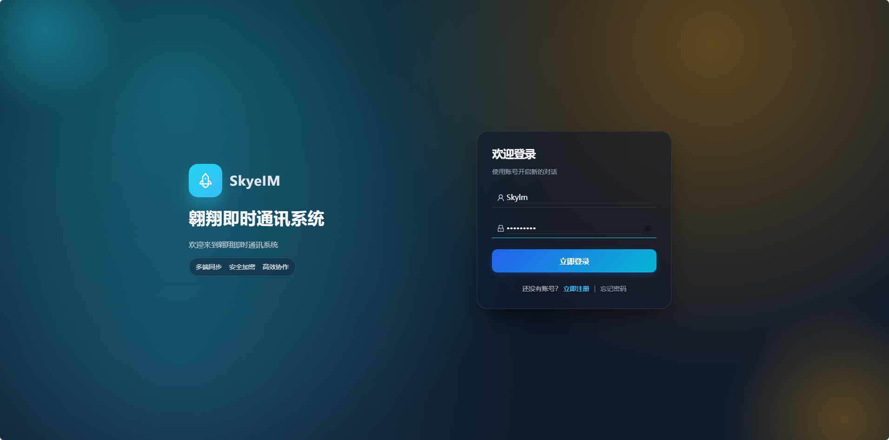
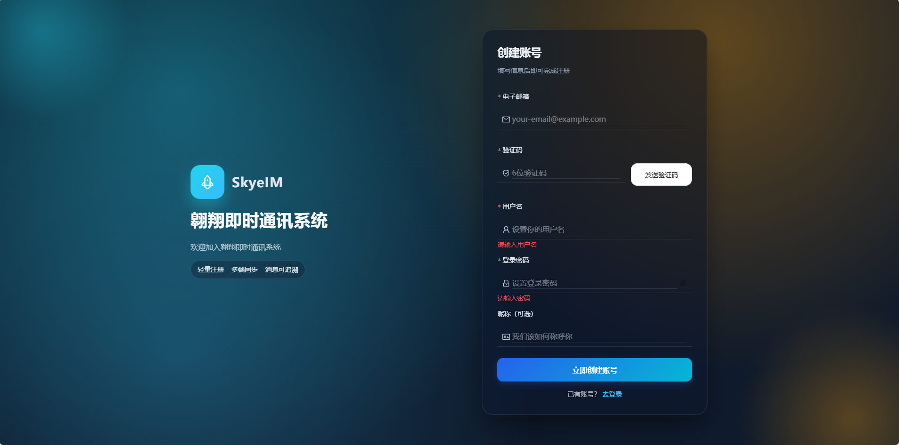
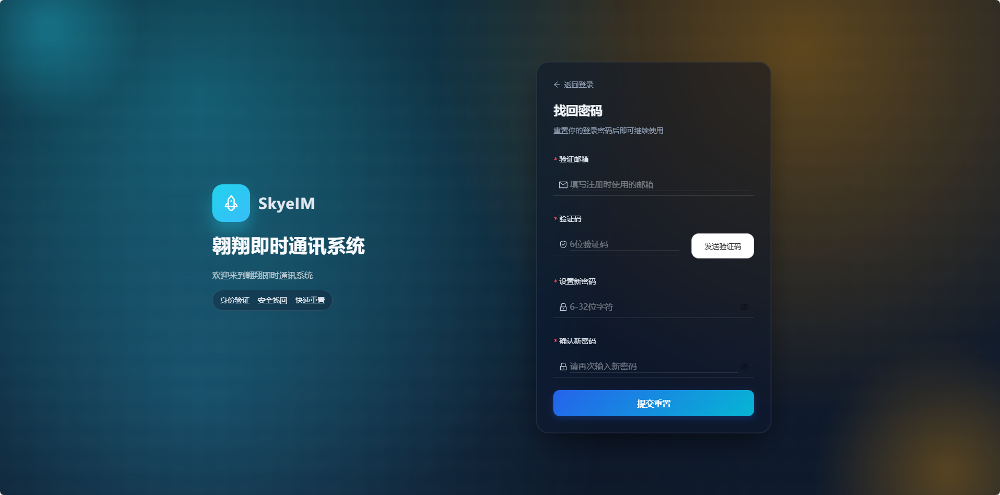
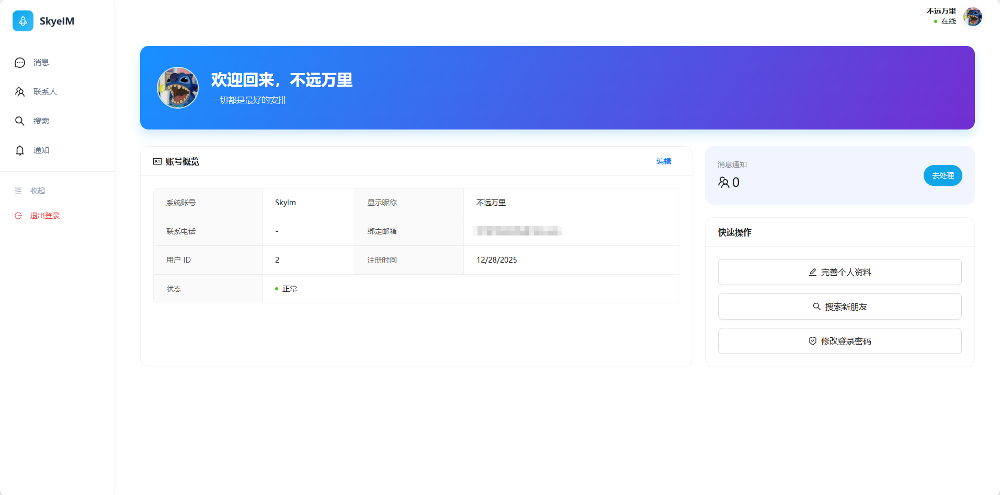
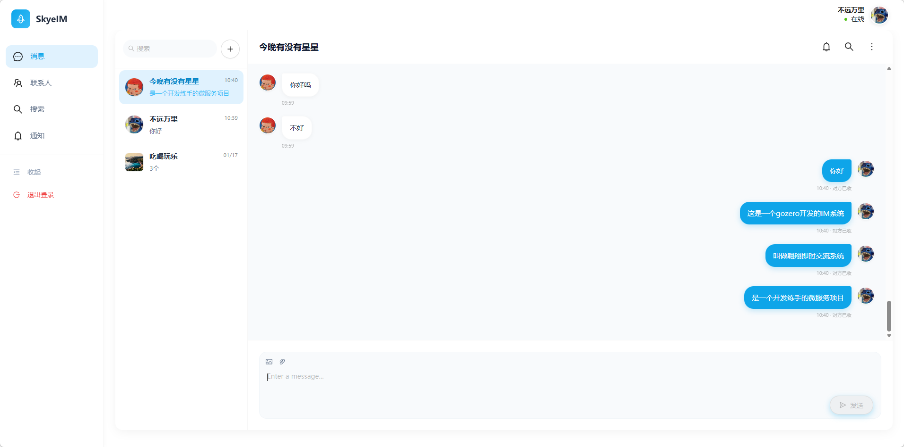
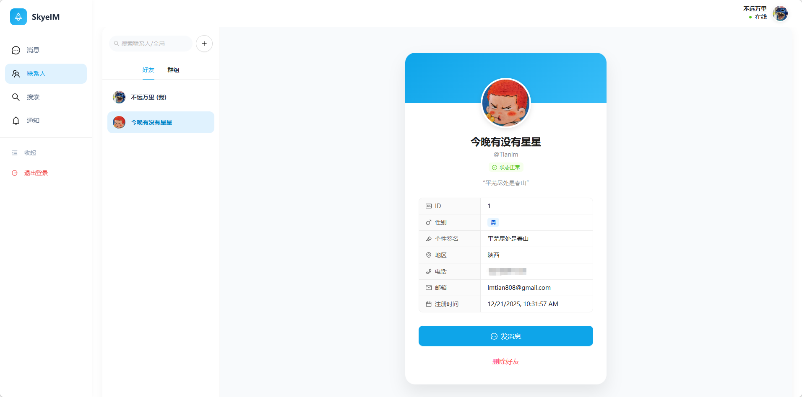
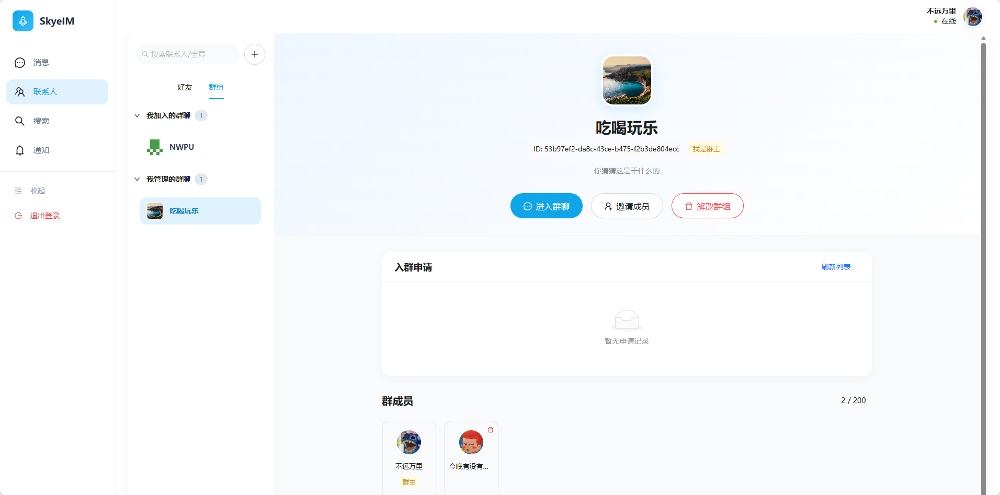
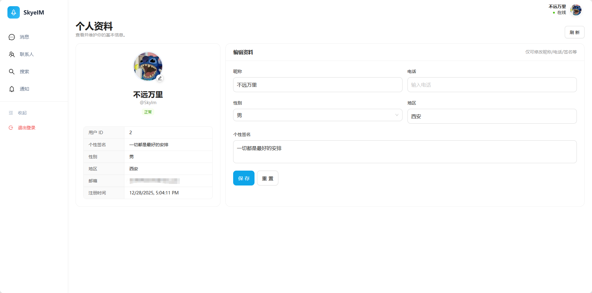

# SkyeIM Frontend (Skye-IM-Front)


SkyeIM-Front 是一个现代化、高性能的即时通讯（IM）应用前端项目。基于 **React 19**、**Vite** 和 **Ant Design 5** 构建，提供流畅的用户体验和优雅的界面设计。

> [!NOTE]
> *后端项目*：[Skye-IM](https://github.com/Skylm808/Skye-IM) - 一个基于 go-zero 框架构建的现代化即时通讯系统，采用微服务架构设计，支持私聊、群聊、好友管理等核心功能。
## ✨ 功能特性

### 🔐 认证与安全
- **用户注册/登录**：支持邮箱验证码注册与安全登录。
- **密码管理**：忘记密码找回流程及修改密码功能。
- **会话持久化**：基于 Token 的认证机制（Access/Refresh Token）。

### 💬 核心通讯
- **实时聊天**：基于 WebSocket 的实时消息传输。
- **群组功能**：支持创建群组、加入群组及群组管理。
- **多媒体支持**：(根据后续开发支持图片/文件发送)。

### 👥 社交关系
- **好友管理**：好友列表展示、备注修改。
- **关系链**：添加好友、处理好友请求、黑名单管理。
- **全局搜索**：支持搜索用户和群组。
- **个人资料**：查看和编辑个人信息。

### 🎨 UI/UX 设计
- **Ant Design 5**：深度定制的主题色（Skye Blue）和圆角风格。
- **响应式布局**：适配不同屏幕尺寸。
- **交互反馈**：完善的加载状态与操作提示。

## 📸 项目截图

### 🔐 认证与安全

**登录界面**


**注册界面**


**密码重置**


### 💬 核心通讯与主页

**系统首页**


**聊天界面**


### 👥 社交与个人

**好友列表**


**群组管理**


**个人中心**

## 🛠️ 技术栈

- **核心框架**: React 19, React Router 7
- **构建工具**: Vite
- **UI 组件库**: Ant Design 5, Lucide React (图标)
- **网络请求**: Axios (封装了拦截器与 Token 刷新)
- **实时通信**: WebSocket
- **代码规范**: ESLint

## 🚀 快速开始

### 环境要求
- Node.js >= 18.0.0
- npm >= 9.0.0

### 安装依赖

```bash
npm install
```

### 启动开发服务器

```bash
npm run dev
```

访问 `http://localhost:5173` 即可查看项目。

### 构建生产版本

```bash
npm run build
```

## 📂 目录结构

```
src/
├── api/             # API 接口定义与 Axios 封装
├── assets/          # 静态资源文件
├── components/      # 公共组件 (布局, 模态框, 业务组件)
│   ├── friend/      # 好友相关组件
│   └── group/       # 群组相关组件
├── hooks/           # 自定义 React Hooks
├── pages/           # 页面级组件 (路由页面)
├── utils/           # 工具函数 (WebSocket, 存储等)
├── App.jsx          # 应用入口与主题配置
└── main.jsx         # 渲染入口
```

## 🤝 贡献指南

欢迎提交 Issue 和 Pull Request！

## 🙏 致谢

本项目前端 UI/UX 设计由 [UI/UX Pro Max Skill](https://github.com/nextlevelbuilder/ui-ux-pro-max-skill) 辅助构建，感谢其提供的帮助。

## 📄 开源协议

MIT License